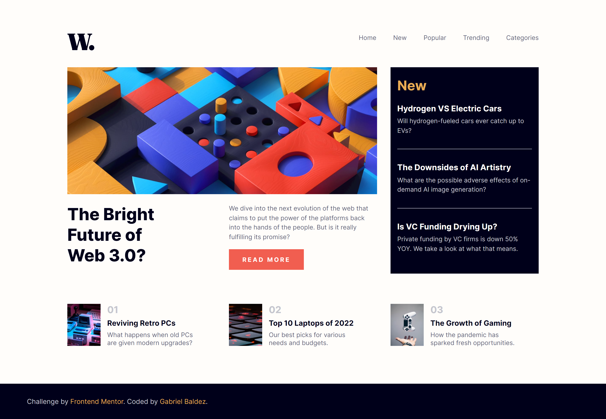

# Frontend Mentor - News homepage solution

This is a solution to the [News homepage challenge on Frontend Mentor](https://www.frontendmentor.io/challenges/news-homepage-H6SWTa1MFl). Frontend Mentor challenges help you improve your coding skills by building realistic projects. 

## Table of contents

- [Frontend Mentor - News homepage solution](#frontend-mentor---news-homepage-solution)
  - [Table of contents](#table-of-contents)
    - [The challenge](#the-challenge)
    - [Screenshot](#screenshot)
    - [Links](#links)
  - [My process](#my-process)
    - [Built with](#built-with)
    - [What I learned](#what-i-learned)
    - [Useful resources](#useful-resources)
  - [Author](#author)


### The challenge

Users should be able to:

- View the optimal layout for the interface depending on their device's screen size
- See hover and focus states for all interactive elements on the page

### Screenshot



### Links

- Solution URL: [Github repository](https://github.com/baldezg/frontend-mentor/tree/main/news-homepage-main)
- Live Site URL: [Live site URL here](https://frontend-mentor-ce59ktn1f-baldezg.vercel.app/news-homepage-main/index.html)

## My process

### Built with

- Semantic HTML5 markup
- CSS custom properties
- Flexbox
- CSS Grid
- Media queries

### What I learned

Use subgrids to enhance the precision and make easy the construct of layout.

```css
.main {
  display: grid;
  grid-area: 1 / 1 / span 2 / span 2;
  grid-template-columns: subgrid;
}
```

### Useful resources

- [Mozilla Developer](https://developer.mozilla.org/en-US/docs/Web/CSS/CSS_grid_layout/Subgrid) - This helped me learn how to use a subgrid to allow nested grids to inherit the sizing and positioning of the parent grid.
- [Kevin Powell - Youtube Channel](https://www.youtube.com/watch?v=HbBMp6yUXO0&t=2258s) - With this video, I learned to make a responsive navbar and I passed to use this approach.

## Author

- Website - [Gabriel Baldez](https://github.com/baldezg)
- Frontend Mentor - [@baldezg](https://www.frontendmentor.io/profile/baldezg)
- Instagram - [@gbaeldaeg](https://www.instagram.com/gbaeldaeg/)