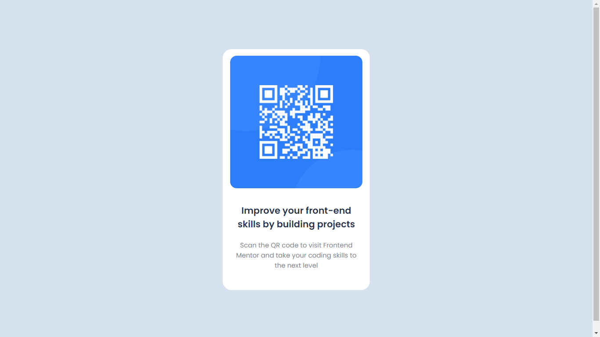

# Frontend Mentor - QR code component solution

This is a solution to the [QR code component challenge on Frontend Mentor](https://www.frontendmentor.io/challenges/qr-code-component-iux_sIO_H). Frontend Mentor challenges help you improve your coding skills by building realistic projects. 

## Table of contents

- [Frontend Mentor - QR code component solution](#frontend-mentor---qr-code-component-solution)
  - [Table of contents](#table-of-contents)
  - [Overview](#overview)
    - [Screenshot](#screenshot)
    - [Links](#links)
    - [My Process](#my-process)
    - [Built with](#built-with)
    - [What I learned](#what-i-learned)
    - [Continued development](#continued-development)
    - [Useful resources](#useful-resources)
  - [Author](#author)

## Overview
Responsive QR code component with HTML and CSS.

### Screenshot



### Links

- Solution URL: [Repository](https://github.com/GBaldez/qr-code-component-main)
- Live Site URL: [Site](https://gbaldez.github.io/qr-code-component-main/)

### My Process

I started learning programming in the last year, learning backend and now I start learning frontend, I already  knowledge HTML and CSS and want to improve my skills with challenges of frontend mentor.

### Built with

- Semantic HTML5 markup
- CSS custom properties
- Flexbox
- Mobile-first workflow

### What I learned

In this project, I put responsive layout, CSS properties, and flexbox into practice.

```css
:root{
    --body-font: 'Poppins', sans-serif;
    --h1-font-size: 1.3rem;
}
```

```css
@media screen and (max-width: 375px) {
    .container {
        margin: 5rem 1.5rem;
    }
}
```

### Continued development

I go follow developing my frontend skills, responsivity, flexbox, and learning ReactJS.

### Useful resources

- [CSS Variables](https://www.youtube.com/watch?v=27JtRAI3QO8) - I learn a lot with this tutorial about CSS.
- [Flexbox and layout responsive](https://www.dio.me/) - This is an amazing site for learning. There are many courses, projects, bootcamps on many languages and technologies.

## Author

- Github - [Gabriel Baldez](https://github.com/GBaldez)
- Frontend Mentor - [@GBaldez](https://www.frontendmentor.io/profile/GBaldez)

